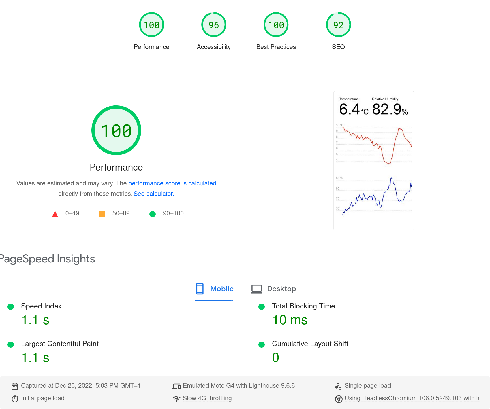

# weather-v3

This is the third iteration of my simple weather station using an AM2302
sensor, this time with a SvelteKit web app on Cloudflare Pages.

https://weather-app.martindisch.workers.dev (currently a Workers Site because
Pages has a small issue with D1 bindings at the moment)

The system has two parts:

- [Base station](weather-station/README.md) with sensor, taking regular
  measurements and uploading them to the backend whenever it has connectivity
- [Backend and client](weather-app/README.md) for storing and interacting with
  current and historical readings

What's cool about it?

- While a toy project like this one doesn't benefit from most of the following,
  deployment on Cloudflare's edge network means great scalability, low
  latencies and no hosting hassle, at the cost of some vendor lock-in.
- For persistence it uses [D1](https://developers.cloudflare.com/d1), which is
  an absolute delight, again with no management overhead and smart features
  like simple global read replication. Plus SQLite is just an amazing piece of
  software.
- With Svelte and SvelteKit it's possible to develop incredibly lightweight
  applications. In fact, this one doesn't even require JavaScript on the client
  to work.
- The whole project is extremely minimal and simple. In terms of logic, it only
  has 316 lines of actual code for both the base station and backend + client.
  Granted, it's a very basic use case with only a single page and going for a
  full framework like SvelteKit is overkill, but I really wanted to try 1.0 now
  that it's out and I couldn't be happier with it.
  ```console
  $ scc -i svelte,ts,rs
  ─────────────────────────────────────────────────────────────────────────────
  Language               Files     Lines   Blanks  Comments     Code Complexity
  ─────────────────────────────────────────────────────────────────────────────
  Svelte                     5       185       26         1      158          3
  TypeScript                 4        96       18         8       70          7
  Rust                       1       114       21         5       88          5
  ─────────────────────────────────────────────────────────────────────────────
  Total                     10       395       65        14      316         15
  ─────────────────────────────────────────────────────────────────────────────
  ```
- All of the above makes for a really fast page and it does get a perfect
  performance score on [PageSpeed Insights](https://pagespeed.web.dev).
  

## License

[MIT License](LICENSE)
